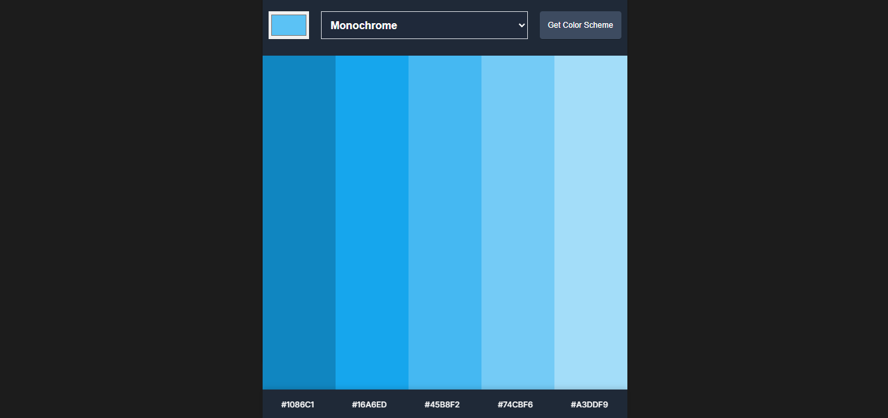

# Color Scheme Generator

A simple web app to generate color palettes using [The Color API](https://www.thecolorapi.com/). Select a base color and a color scheme mode, and instantly get a palette of 5 colors. Click any color to copy its hex code to your clipboard.

## Features
- Choose a base color with a color picker
- Select from 8 color scheme modes (monochrome, analogic, triad, etc.)
- Instantly fetch and display a palette of 5 colors
- Click any color to copy its hex code
- Responsive and modern UI

## Usage
1. Open the app in your browser (or [view the deployed site](https://mercurialw0rld.github.io/color_scheme_generator/))
2. Pick a color and a scheme mode
3. Click "Get Color Scheme"
4. Click any color block to copy its hex code

## Development
- Clone this repo: `git clone https://github.com/mercurialw0rld/color_scheme_generator.git`
- Open `index.html` in your browser
- All logic is in `script.js`, styles in `styles.css`

